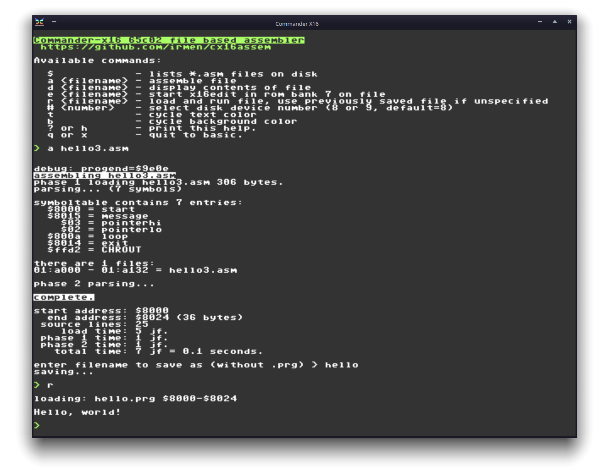

# cx16assem

File-based 65c02 assembler for Commander-X16

Software License: MIT open source, see file LICENSE.

You'll need a recent Prog8 compiler, to build the assembler from source.
If the latest official release gives you problems compiling this program, you may have to use 
the git master version that hasn't been officially released yet.

## Compiling the assembler

The assembler requires some autogenerated code for instruction matching.
This code is created by a python script. You can do this manually and then use
the Prog8 compiler `p8compile` to finally compile the assembler, but
it's easier to use the supplied Makefile: 

Just type `make` to compile the assembler.
Type `make emu` to compile and immediately start the assembler in the Commander X16 emulator.

## Usage

Usage should be self-explanatory: when started, the assembler prints the available commands.
After successfully assembling a source file, a summary will be printed. 
You can then enter the filename to save the program as on disk (will overwrite existing file with the same name!).
It's always saved in PRG format, so you can load the program again with `LOAD "NAME",8,1`

Note: when your program is in the same memory as the assembler itself, it will obviously overwrite the assembler
when you load it to be executed. The assembler won't be usable again after this.
So for quick edit-assemble-save-run cycles, make sure your program loads outside the assembler program memory area!
*For now, a lower start address of $5000 is safe. This may change once the assembler grows in size due to new features.*
*Pay attention to the end address printed when you load the assembler to see where its memory ends.*

The built-in self test requires the two "test-allopcodes" files from the test directory here, to be copied onto the sdcard of the x16.
The .asm file contains 65c02 source code with all possible valid instructions (opcodes 0-255) and the check file contains 
the expected result binary (crossassembled by 64tass).

## Features

- all w65c02 instructions recognised, except the 4 problematic ones  SMBx RMBx BBRx BBSx (due to X16 65816 cpu support)
- reads source files (any size) from disk  (sdcard)
- write resulting output directly as PRG file to disk (sdcard)
- can assemble to any system memory location 
- able to assemble into programs of up to 64Kb in output size
- set program counter with `* = $9000` or `.org  $9000`
- numbers can be written in decimal `12345`, hex `$abcd`, binary `%1010011`
- symbolic labels
- symbol defines ('variables')
- use `<value` and `>value` to get the lsb and msb of a value respectively
- define data with `.byte  1,2,3,4`, `.word $a004,$ffff`, `.fill 100` (insert 100 zero bytes), `.fill 999,$42` (insert 999 bytes with value $42)
- define strings with `.str  "hello!"` and `.strz  "zeroterminatedstring"`
- include binary data from a file using `.incbin "filename"`
- include source code from a file using `.include "filename"`
- disk device 8 and 9 selectable
- configurable text and screen colors
- can switch to (rom-based) X16Edit to edit a file, to avoid having to swap-load programs all the time.
- includes a convenient 'r' run command to immediately load and execute the saved program file (or another file) to speed up work flow
- for speed reasons, the source text is parsed in a case-sensitive way.
  Everything has to be in lowercase petscii, or it will be a syntax error. Except labels and instruction mnemonics; they can contain upppercase petscii letters if you want.
- likewise, for speed reasons, there's a line length limit of 160 characters *that is not checked*. Don't use source code lines that exceed this length as that will corrupt the assembler program.
- to keep the internals simpler, the assembler stops at first error it encounters.

## How it works internally

- Files are read into the banked hiram $a000-$c000, starting from bank 1 (bank 0 is reserved for the kernal)
- Metadata about the files (name, address, size) is stored in tables in regular system ram.
- Parsing is done on lines from the source files that are copied to a small buffer in system ram to be tokenized.
- Parse phase 1 just builds the symbol table in system ram. This is a hash table for fast lookups.
- Parse phase 2 actually outputs machine code into the last 8 himem banks (64 Kb max output size).
- Finally, the data in these output banks is written to the output prg file on disk.
- Mnemonics matching is done via an optimal prefix-tree match routine that takes very few instructions to find the match.

## Todo

- BUG? multiple .include don't work?  (github issue)

- Simple expressions of just 2 operands and an operator (+, -, bitwise and/or/xor, bitwise shifts, maybe simple multiplication). 
  More complex expressions (including parentheses) are a *lot* of work (require having an expression evaluation stack) so may never be supported.
  (although https://en.wikipedia.org/wiki/Shunting_yard_algorithm ?)

- relative labels (+/++/-/--) or rather local labels @1 @2 etc (ca65 style)

- better error descriptions?

- macros?

- A *lot* of work, so may never be realized: locally scoped labels, or at the very least a new scope for included assembly files to avoid name clashes
